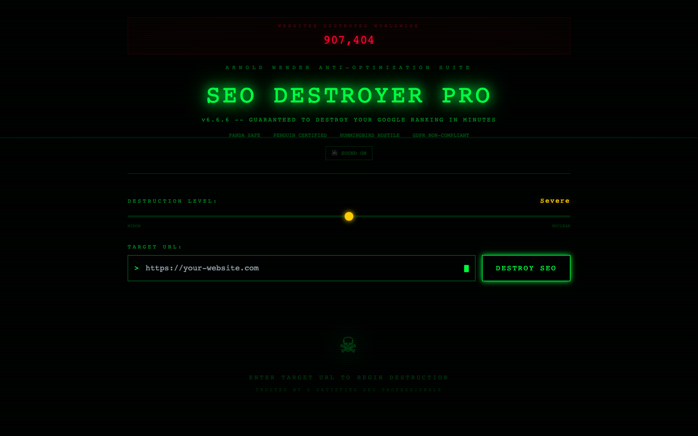

# :skull: SEO Destroyer Pro

**The world's first tool dedicated to obliterating your website's search rankings.**

Built by [Arnold Wender](https://arnoldwender.com)

[](https://seo-destroyer-pro.netlify.app)

---



## What is this?

A parody SEO tool that "destroys" your website's SEO with absurd anti-recommendations. Enter any URL and watch in horror as our proprietary Destruction Engine generates the worst possible SEO advice — complete with a destruction certificate to prove you did it.

> "Finally, a tool that tells you to put your entire site in an iframe and use Comic Sans for all headings." — Nobody, ever

## Features

- **Destruction Slider** — Dial your SEO destruction from "Mild Inconvenience" to "Nuclear Meltdown"
- **Certificate Generator** — Get an official SEO Destruction Certificate (shareable!) via html2canvas
- **Confetti Celebration** — Because destroying SEO should feel like a party
- **Sound Effects** — Satisfying destruction noises via Web Audio API
- **Share Cards** — Generate and share your destruction results on social media
- **Easter Eggs** — Hidden surprises for the truly dedicated destroyers
- **Toast Notifications** — Sarcastic feedback at every step

## Tech Stack

| Technology | Purpose |
|---|---|
| React 18 | UI framework |
| TypeScript | Type safety |
| Vite | Build tool & dev server |
| Tailwind CSS | Styling |
| Framer Motion | Animations |
| canvas-confetti | Confetti effects |
| html2canvas | Certificate/share card generation |
| Web Audio API | Sound effects |
| Lucide React | Icons |

## Getting Started

```bash
# Clone the repo
git clone https://github.com/arnoldwender/seo-destroyer-pro.git
cd seo-destroyer-pro

# Install dependencies
npm install

# Start dev server
npm run dev

# Build for production
npm run build
```

## Live Demo

**[https://seo-destroyer-pro.netlify.app](https://seo-destroyer-pro.netlify.app)**

## License

MIT
